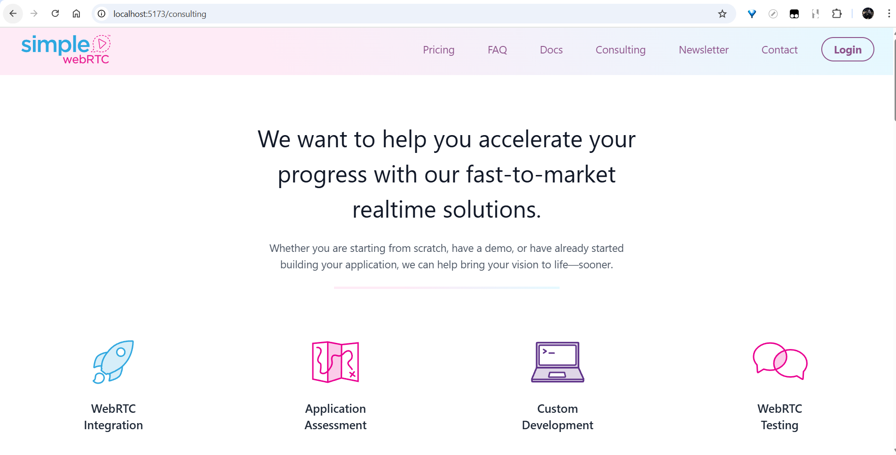
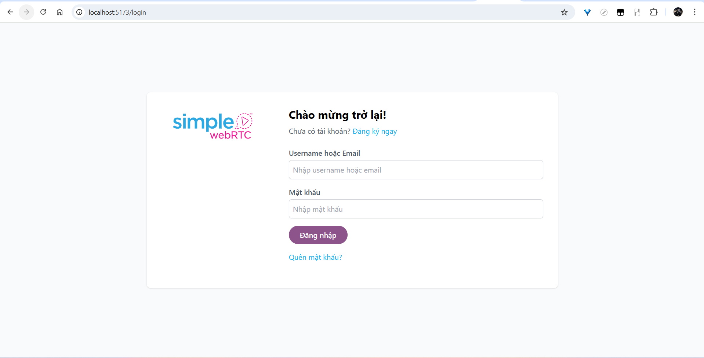
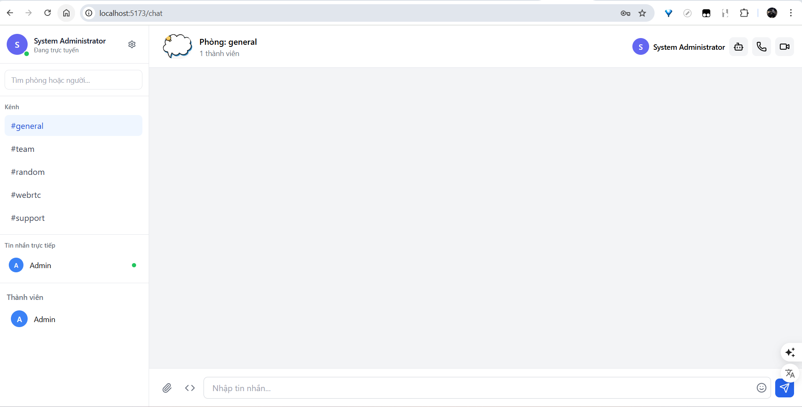
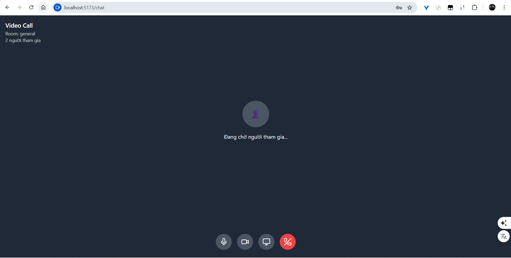

<p align="center">
  
  
</p>

<h1 align="center">💬 Chat & FaceTime & Code Thông Minh</h1>
<p align="center">Hệ thống chat, video call và code editor thông minh dành cho lập trình viên</p>

<p align="center">
  
  
  
  
  
  
</p>

---

## 🔰 Giới thiệu

**Chat & FaceTime & Code Thông Minh** là hệ thống **chat, video call và code editor** được phát triển cho lập trình viên.  
Ứng dụng được xây dựng với **Spring Boot (Backend)** và **React (Frontend)**, tích hợp **WebSocket (STOMP)** để hỗ trợ **real-time communication**, cùng **AI Assistant** và **giao diện hiện đại** bằng Tailwind CSS.

---

## 🚀 Tính năng chính

### ⚙️ Backend (Spring Boot)
- 🔐 Hệ thống xác thực **JWT** với Spring Security  
- 👤 Quản lý người dùng bằng **MySQL**  
- 🔄 **WebSocket** hỗ trợ chat thời gian thực  
- 🧩 RESTful API cho đăng nhập, đăng ký, quản lý  
- 🧱 Tự động validate dữ liệu đầu vào  
- 🧰 Admin Dashboard API với phân quyền và thống kê  

### 💻 Frontend (React)
- 🎨 Giao diện **đăng nhập / đăng ký** chuyên nghiệp  
- 🧭 **Admin Dashboard** với CRUD người dùng  
- 💬 Chat UI với **WebSocket (STOMP over SockJS)**  
- 🧠 Tích hợp **AI Assistant** giúp lập trình viên hỗ trợ code thông minh  
- 🧑‍💻 Code Editor (đang phát triển)  
- ⚡ Quản lý state bằng **React Hooks**  
- 📱 Giao diện **Responsive** với **Tailwind CSS**  

---

## 🧩 Công nghệ sử dụng

| Loại | Công nghệ |
|------|------------|
| **Ngôn ngữ** | Java 17+, JavaScript (ES6+), JSX |
| **Backend** | Spring Boot, Spring Security, JPA, WebSocket (STOMP), JWT |
| **Frontend** | React, Vite, Tailwind CSS, SockJS, StompJS |
| **Database** | MySQL 8.0+ |
| **Build Tools** | Maven, npm |
| **Khác** | AI Assistant (OpenAI API integration), LocalStorage Token, Validation client & server |

---

## 🛠️ Cài đặt & Chạy

### 🔹 1. Cài đặt Backend
```bash
cd chat-facetime-smart-dev/backend

# Cài dependencies
mvn clean install

# Chạy ứng dụng
mvn spring-boot:run
📍 Backend chạy tại: http://localhost:8080

🔹 2. Cài đặt Frontend
bash
cd chat-facetime-smart-dev/frontend

# Cài dependencies
npm install

# Chạy ứng dụng
npm run dev
📍 Frontend chạy tại: http://localhost:5173

🔹 3. Cấu hình Database
sql

CREATE DATABASE smart_chat_db;
Cập nhật trong application.properties:

properties

spring.datasource.url=jdbc:mysql://localhost:3306/smart_chat_db?createDatabaseIfNotExist=true&useSSL=false&serverTimezone=UTC
spring.datasource.username=root
spring.datasource.password=your_password
🔐 Tài khoản mặc định
Loại	Username	Password
🧑‍💼 Admin	admin	12345
👤 User	Đăng ký mới trên giao diện (email phải có @, mật khẩu ≥ 1 chữ hoa & 1 số, username ≥ 3 ký tự)	

🧱 Cấu trúc dự án
bash
Copy code
chat-facetime-smart-dev/
├── backend/
│   ├── src/main/java/
│   │   ├── config/          # Cấu hình Security, WebSocket
│   │   ├── controller/      # REST Controllers
│   │   ├── dto/             # Data Transfer Objects
│   │   ├── entity/          # JPA Entities
│   │   ├── repository/      # JPA Repositories
│   │   ├── service/         # Business Logic
│   │   └── util/            # JWT Utilities
│   └── resources/
│       └── application.properties
├── frontend/
│   ├── src/
│   │   ├── components/      # React Components
│   │   ├── pages/           # Page Components
│   │   ├── routes/          # Routing
│   │   └── services/        # API + Socket Services
│   └── package.json
└── README.md
🔧 API Endpoints
Authentication
Method	Endpoint	Mô tả
POST	/api/auth/login	Đăng nhập
POST	/api/auth/register	Đăng ký
GET	/api/auth/me	Lấy thông tin user hiện tại

Admin
Method	Endpoint	Mô tả
GET	/api/admin/dashboard	Thống kê tổng quan
GET	/api/admin/users	Danh sách người dùng
PUT	/api/admin/users/{id}/toggle-status	Bật/tắt user
PUT	/api/admin/users/{id}/role	Cập nhật quyền
DELETE	/api/admin/users/{id}	Xóa người dùng

🖼️ Giao diện ứng dụng
<p align="center">
   
   
</p> 
<p align="center">
   
   
</p>
💡 

🚧 Tính năng đang phát triển
💬 Chat real-time qua WebSocket

🎥 Video call với WebRTC

🧑‍💻 Code editor tích hợp

🤖 AI Assistant hỗ trợ lập trình

📎 File sharing

🖥️ Screen sharing

📝 Ghi chú
🔐 Sử dụng JWT cho xác thực

💾 Lưu token ở localStorage phía client

🧱 Tự động tạo bảng database khi chạy lần đầu

🌐 CORS đã được cấu hình cho môi trường phát triển

🤝 Đóng góp
Fork dự án

Tạo branch mới:

bash
git checkout -b feature/AmazingFeature
Commit thay đổi

bash
git commit -m "Add some AmazingFeature"
Push lên branch

bash
git push origin feature/AmazingFeature
Tạo Pull Request

📄 License
Distributed under the MIT License.
See LICENSE for more information.

<p align="center"> ⭐ Nếu dự án này hữu ích, hãy cho nó một ngôi sao trên GitHub nhé! ⭐ </p> ```

## 📌 Tác giả

👨‍💻 Phát triển bởi: **[Nguyễn Hoàng Lê]**
📅 Năm: 2025